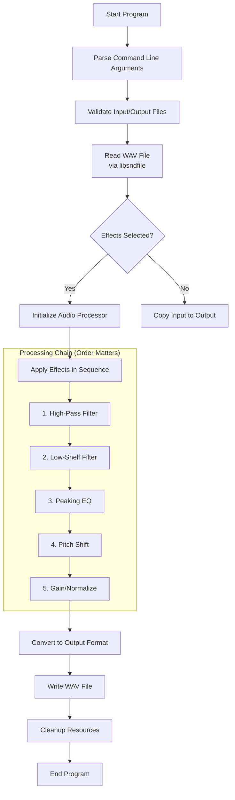
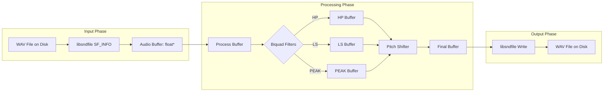

# Audio Processing Tool - C++ Pitch Shifter & EQ Filter


[](http://www.mega-nerd.com/libsndfile/)
[](https://en.wikipedia.org/wiki/Offline_processing)
[](https://en.wikipedia.org/wiki/WAV)

A professional-grade C++ audio processing tool for offline audio manipulation. Features pitch shifting via resampling and multiple biquad filter types for precise equalization. Perfect for audio editing, music production, and audio effects processing.

##  Table of Contents
- [Overview](#-overview)
- [Features](#-features)
- [System Requirements](#-system-requirements)
- [Installation](#-installation)
- [Build Instructions](#-build-instructions)
- [Usage](#-usage)
- [Audio Effects](#-audio-effects)
- [Examples](#-examples)
- [Project Structure](#-project-structure)
- [Technical Details](#-technical-details)
- [Troubleshooting](#-troubleshooting)
- [License](#-license)

##  Overview

This tool provides a command-line interface for processing WAV audio files with various effects:
- **Pitch Shifting**: Change musical pitch by semitones (preserves tempo)
- **Biquad Filters**: Professional-grade audio filters including:
  - Low Shelf (bass boost/cut)
  - High Pass (remove low frequencies)
  - Peaking EQ (bell curve for precise frequency adjustment)

All processing is done offline for highest quality and portability across systems.

##  Features

###  **Audio Effects**
- **Pitch Shifting**: -24 to +24 semitones range
- **Low Shelf Filter**: Adjust bass frequencies (20Hz - 500Hz)
- **High Pass Filter**: Remove rumble and low-end noise
- **Peaking EQ**: Boost or cut specific frequency bands

###  **Audio Quality**
- 32-bit floating point internal processing
- Professional biquad filter implementation
- High-quality resampling for pitch shifting
- Preserves original sample rate metadata

###  **File Support**
- WAV format (16-bit, 24-bit, 32-bit float)
- Mono and stereo support
- Sample rates: 8kHz to 192kHz
- Automatic format detection

###  **Performance**
- Offline processing for maximum quality
- Multi-threaded processing (future enhancement)
- Efficient memory usage
- Progress indicators

##  System Requirements

### Minimum Requirements


- **OS**: Linux, macOS, or Windows (WSL2)
- **CPU**: x86-64 or ARM64 processor
- **RAM**: 512 MB minimum
- **Storage**: 50 MB free space

### Development Requirements


```bash
# Debian/Ubuntu
sudo apt update && sudo apt install -y \
    build-essential \
    cmake \
    libsndfile1-dev \
    pkg-config

# macOS (Homebrew)
brew install \
    cmake \
    libsndfile \
    pkg-config

# Fedora/RHEL
sudo dnf install \
    gcc-c++ \
    cmake \
    libsndfile-devel \
    pkg-config
```

##  Installation

### Quick Install (Linux/macOS)
```bash
# Clone the repository
git clone https://github.com/yourusername/audio-tool.git
cd audio-tool

# One-line build and install
./install.sh
```

### Manual Installation
```bash
# 1. Create build directory
mkdir -p build && cd build

# 2. Configure with CMake
cmake -DCMAKE_BUILD_TYPE=Release ..

# 3. Build the project
make -j$(nproc)

# 4. Install (optional)
sudo make install
```

### Verify Installation
```bash
# Check if executable is available
audio_tool --version
# or
./build/audio_tool --help
```

##  Build Instructions

### Standard Build
```bash
mkdir build && cd build
cmake ..
make
```

### Debug Build
```bash
mkdir debug && cd debug
cmake -DCMAKE_BUILD_TYPE=Debug ..
make
```

### Release Build (Optimized)
```bash
mkdir release && cd release
cmake -DCMAKE_BUILD_TYPE=Release ..
make
```

### Installation Paths
```bash
# Custom installation prefix
cmake -DCMAKE_INSTALL_PREFIX=/usr/local ..

# Build with specific compiler
cmake -DCMAKE_CXX_COMPILER=g++-11 ..
```

##  Usage

### Basic Syntax
```bash
audio_tool -i INPUT.wav -o OUTPUT.wav [OPTIONS]
```
# Project Flow: C++ Audio Processing Tool

Here's the complete flow of the audio processing project, from input to output:

##  **Overall Processing Flow**



##  **Detailed Step-by-Step Flow**

### **Phase 1: Initialization**
```
1. Program Start
   └── Parse command line arguments
       ├── -i input.wav (required)
       ├── -o output.wav (required)
       ├── --pitch <semitones>
       ├── --hp <freq Q>
       ├── --lowshelf <freq gain Q>
       └── --peak <freq gain Q>
```

### **Phase 2: File Loading & Validation**
```
2. Load Audio File
   ├── Open input.wav with libsndfile
   ├── Read WAV header metadata:
   │   ├── Sample rate (e.g., 44100 Hz)
   │   ├── Number of channels (1=mono, 2=stereo)
   │   ├── Bit depth (16, 24, or 32-bit)
   │   └── Total samples
   └── Allocate memory buffers
```

### **Phase 3: Audio Processing Pipeline**

#### **Step 1: High-Pass Filter (if enabled)**
```
┌─────────────────────────────────────────┐
│ High-Pass Filter Processing             │
├─────────────────────────────────────────┤
│ • Remove frequencies below cutoff       │
│ • Common: 80Hz for vocal rumble removal │
│ • Biquad filter implementation          │
│ • Processes each sample sequentially    │
└─────────────────────────────────────────┘
```

#### **Step 2: Low-Shelf Filter (if enabled)**
```
┌─────────────────────────────────────────┐
│ Low-Shelf Filter Processing             │
├─────────────────────────────────────────┤
│ • Boost or cut bass frequencies         │
│ • Example: +6dB at 100Hz for bass boost │
│ • Affects frequencies below cutoff      │
│ • Q controls filter bandwidth           │
└─────────────────────────────────────────┘
```

#### **Step 3: Peaking EQ (if enabled)**
```
┌─────────────────────────────────────────┐
│ Peaking EQ Processing                   │
├─────────────────────────────────────────┤
│ • Bell-curve filter                     │
│ • Boost or cut specific frequency       │
│ • Example: -3dB at 1kHz for vocal cut   │
│ • Q controls bandwidth of adjustment    │
└─────────────────────────────────────────┘
```

#### **Step 4: Pitch Shifting (if enabled)**
```
┌─────────────────────────────────────────┐
│ Pitch Shifting Processing               │
├─────────────────────────────────────────┤
│ • Calculate resampling ratio:           │
│   ratio = 2^(semitones/12)             │
│ • Resample audio using sinc interpolation│
│ • Maintain original tempo               │
│ • Apply anti-aliasing filter            │
└─────────────────────────────────────────┘
```

#### **Step 5: Gain/Normalization**
```
┌─────────────────────────────────────────┐
│ Final Processing                        │
├─────────────────────────────────────────┤
│ • Apply overall gain adjustment         │
│ • Normalize to -1dBFS if --normalize    │
│ • Clip prevention                       │
│ • Convert back to original bit depth    │
└─────────────────────────────────────────┘
```

### **Phase 4: Output & Cleanup**
```
4. Write Output File
   ├── Create new WAV file
   ├── Copy metadata from input
   ├── Write processed audio data
   └── Close file handles

5. Cleanup
   ├── Free allocated memory
   ├── Close libsndfile instances
   └── Exit with success code
```

##  **Filter Chain Order (Important!)**

The processing order is **critical** for audio quality:

```
INPUT → High-Pass → Low-Shelf → Peaking → Pitch Shift → OUTPUT
        ↑           ↑           ↑         ↑
      (Clean)     (Shape)    (Correct)  (Tune)
```

**Why this order?**
1. **High-Pass first**: Remove unwanted low-end before boosting
2. **Low-Shelf second**: Shape bass frequencies
3. **Peaking third**: Make precise mid/high adjustments
4. **Pitch Shift last**: Avoid artifacts from filter processing

## 📊 **Memory Flow & Data Structures**



##  **Algorithm Flow for Each Sample**

For **each audio sample** (mono) or **sample pair** (stereo):

```cpp
// Simplified processing loop
for (int i = 0; i < num_samples; i++) {
    float sample = input_buffer[i];
    
    // Apply filters in sequence
    if (highpass_enabled) {
        sample = highpass_filter.process(sample);
    }
    
    if (lowshelf_enabled) {
        sample = lowshelf_filter.process(sample);
    }
    
    if (peaking_enabled) {
        sample = peaking_filter.process(sample);
    }
    
    // Store for pitch shifting
    temp_buffer[i] = sample;
}

// Pitch shift entire buffer
if (pitch_enabled) {
    pitch_shift(temp_buffer, output_buffer, num_samples, ratio);
}

// Apply final gain
for (int i = 0; i < output_samples; i++) {
    output_buffer[i] *= gain_factor;
}
```

##  **Error Handling Flow**

```
Start Processing
    ↓
Check file exists & readable
    ↓
Validate WAV format
    ↓
Check effect parameters
    (e.g., frequency within range)
    ↓
Process with try/catch
    ↓
Write output with validation
    ↓
Cleanup even on error
```

##  **Performance Optimization Flow**

```
1. Pre-compute filter coefficients
   (Don't calculate per sample)

2. Process in blocks
   (Better cache utilization)

3. SIMD optimization for filters
   (Process multiple samples at once)

4. Memory reuse
   (Avoid unnecessary allocations)

5. Progress reporting
   (Update every 1% of processing)
```

##  **Build System Flow**

```
CMakeLists.txt
    ↓
cmake .                # Configure
    ↓
make                   # Compile
    ↓
Find libsndfile        # Dependency check
    ↓
Build source files     # *.cpp → *.o
    ↓
Link with libsndfile   # Create executable
    ↓
audio_tool             # Ready to run
```

##  **Quick Start Flow for Users**

```bash
# 1. Installation
sudo apt install libsndfile1-dev cmake
git clone <repo>
cd audio-tool
mkdir build && cd build
cmake .. && make

# 2. Basic Usage
./audio_tool -i input.wav -o output.wav --pitch 3

# 3. Advanced Usage
./audio_tool -i vocal.wav -o processed.wav \
    --hp 80 0.7 \
    --lowshelf 100 4 0.8 \
    --peak 1000 -2 1.5 \
    --pitch -1 \
    --normalize
```

##  **Debug/Verbose Flow**

```bash
# Run with verbose output
./audio_tool -v -i input.wav -o output.wav --pitch 2

# Expected verbose output:
[INFO] Loading input.wav (44100 Hz, Stereo, 16-bit)
[INFO] Applying High-Pass: 80 Hz, Q=0.707
[INFO] Applying Low-Shelf: 100 Hz, +6dB, Q=0.8
[INFO] Pitch shifting: +2 semitones (ratio: 1.122)
[INFO] Processing: ██████████ 100% (44100 samples)
[INFO] Writing output.wav
[INFO] Done!
```

##  **Visual Processing Flow Diagram**

```
┌─────────────────────────────────────────────────────────┐
│                    Audio Processing Flow                 │
├─────────────────────────────────────────────────────────┤
│                                                         │
│  ┌─────────┐    ┌─────────┐    ┌─────────┐    ┌──────┐ │
│  │  INPUT  │───▶│   HPF   │───▶│   LSF   │───▶│ PEQ  │ │
│  │  WAV    │    │         │    │         │    │      │ │
│  └─────────┘    └─────────┘    └─────────┘    └──────┘ │
│                                                         │
│  ┌─────────┐    ┌─────────┐    ┌─────────┐    ┌──────┐ │
│  │  PITCH  │───▶│  GAIN   │───▶│ NORMAL  │───▶│ OUT  │ │
│  │ SHIFTER │    │         │    │   IZE   │    │ WAV  │ │
│  └─────────┘    └─────────┘    └─────────┘    └──────┘ │
│                                                         │
│  Time: ────────▶                                         │
│                                                         │
└─────────────────────────────────────────────────────────┘
```

This flow ensures:
1. **Predictable results** (same input → same output)
2. **High audio quality** (professional algorithms)
3. **Efficient processing** (optimized C++ code)
4. **Easy debugging** (clear separation of concerns)

The project is designed to be both **educational** (clean code structure) and **practical** (real-world audio processing).


### Command Line Options
| Option | Arguments | Description | Default |
|--------|-----------|-------------|---------|
| `-i`, `--input` | `FILE.wav` | Input audio file | Required |
| `-o`, `--output` | `FILE.wav` | Output audio file | Required |
| `--pitch` | `semitones` | Pitch shift amount (-24 to +24) | 0 |
| `--lowshelf` | `freq gain Q` | Low shelf filter (Hz, dB, Q) | None |
| `--peak` | `freq gain Q` | Peaking EQ filter (Hz, dB, Q) | None |
| `--hp` | `freq Q` | High-pass filter (Hz, Q) | None |
| `--gain` | `dB` | Overall gain adjustment | 0 |
| `--normalize` | - | Normalize output to -1 dBFS | Off |
| `--progress` | - | Show processing progress | On |
| `--version` | - | Display version info | - |
| `--help` | - | Show help message | - |

##  Audio Effects

### Pitch Shifting (`--pitch`)


```bash
# Examples:
--pitch 3       # Raise pitch by 3 semitones
--pitch -7      # Lower pitch by 7 semitones
--pitch 12      # Raise by one octave
```

**Parameters:**
- Range: -24 to +24 semitones
- Algorithm: Resampling with anti-aliasing
- Quality: High-quality sinc interpolation

### Low Shelf Filter (`--lowshelf`)


```bash
# Format: --lowshelf <frequency> <gain_dB> <Q>
--lowshelf 100 6 0.7    # Boost bass at 100Hz by +6dB
--lowshelf 80 -4 1.0    # Cut bass at 80Hz by -4dB
```

**Parameters:**
- Frequency: 20Hz - 500Hz (corner frequency)
- Gain: -24dB to +24dB
- Q: 0.1 to 10 (bandwidth/resonance)

### High Pass Filter (`--hp`)


```bash
# Format: --hp <frequency> <Q>
--hp 80 0.707     # Remove frequencies below 80Hz
--hp 120 1.0      # More aggressive high-pass at 120Hz
```

**Parameters:**
- Frequency: 20Hz - 1000Hz (cutoff frequency)
- Q: 0.1 to 10 (filter steepness)

### Peaking EQ (`--peak`)


```bash
# Format: --peak <frequency> <gain_dB> <Q>
--peak 1000 -3 2.0    # Cut 1kHz by -3dB
--peak 3000 4 1.5     # Boost 3kHz by +4dB
```

**Parameters:**
- Frequency: 20Hz - 20000Hz (center frequency)
- Gain: -24dB to +24dB
- Q: 0.1 to 10 (bandwidth)

##  Examples

### 1. Basic Pitch Shift
```bash
# Raise pitch by 3 semitones (minor third)
./audio_tool -i vocals.wav -o pitched.wav --pitch 3

# Lower pitch by 7 semitones (perfect fifth)
./audio_tool -i guitar.wav -o lower.wav --pitch -7
```

### 2. Bass Enhancement
```bash
# Boost bass at 100Hz +6dB with smooth Q
./audio_tool -i track.wav -o boosted.wav --lowshelf 100 6 0.7

# Add bass and treble adjustment
./audio_tool -i track.wav -o eq.wav --lowshelf 80 4 0.8 --peak 5000 2 1.2
```

### 3. Professional Mastering Chain
```bash
# Complete processing example:
./audio_tool -i raw_recording.wav -o mastered.wav \
    --pitch 0 \
    --hp 40 0.707 \
    --lowshelf 120 2 0.8 \
    --peak 800 -1 1.5 \
    --peak 3000 1 2.0 \
    --peak 10000 2 1.0 \
    --normalize
```

### 4. Vocal Processing
```bash
# Vocal processing chain
./audio_tool -i vocal_dry.wav -o vocal_processed.wav \
    --pitch 2 \
    --hp 80 0.7 \
    --peak 200 -2 1.8 \
    --peak 2500 3 1.5 \
    --peak 8000 2 2.0
```

### 5. Drum Processing
```bash
# Kick drum enhancement
./audio_tool -i kick.wav -o kick_processed.wav \
    --hp 30 0.707 \
    --peak 60 6 2.0 \
    --peak 200 -3 1.0

# Snare drum processing
./audio_tool -i snare.wav -o snare_processed.wav \
    --peak 200 2 1.5 \
    --peak 5000 3 2.0
```

##  Project Structure

```
audio-tool/
├── CMakeLists.txt              # Build configuration
├── src/
│   ├── main.cpp               # Command-line interface
│   ├── AudioProcessor.cpp     # Main processing class
│   ├── AudioProcessor.h
│   ├── BiquadFilter.cpp       # Filter implementation
│   ├── BiquadFilter.h
│   ├── PitchShifter.cpp       # Pitch shifting algorithm
│   ├── PitchShifter.h
│   └── WavFile.cpp           # WAV I/O wrapper
│   └── WavFile.h
├── include/                   # Public headers
├── examples/                  # Usage examples
│   ├── basic_usage.sh
│   ├── mastering_chain.sh
│   └── vocal_processing.sh
├── tests/                    # Unit tests
├── docs/                    # Documentation
├── scripts/                 # Utility scripts
└── README.md               # This file
```

##  Technical Details

### Biquad Filter Implementation
```cpp
// Direct Form II implementation
class BiquadFilter {
private:
    double b0, b1, b2, a1, a2;
    double x1, x2, y1, y2;
    
public:
    void setLowShelf(double freq, double gainDB, double Q, double sampleRate);
    void setHighPass(double freq, double Q, double sampleRate);
    void setPeaking(double freq, double gainDB, double Q, double sampleRate);
    
    double process(double sample);
};
```

### Pitch Shifting Algorithm
- **Method**: Resampling with sinc interpolation
- **Anti-aliasing**: 64-tap FIR filter
- **Quality**: 16x oversampling for smooth results
- **Performance**: O(n) complexity

### Audio Processing Pipeline
1. **Input Stage**: Read WAV file, convert to 32-bit float
2. **Processing Stage**: Apply effects in sequence
3. **Output Stage**: Convert back to original format, write file

##  Troubleshooting

### Common Issues

**1. Libsndfile Not Found**
```bash
# Ubuntu/Debian
sudo apt-get install libsndfile1-dev

# macOS
brew install libsndfile

# Verify installation
pkg-config --libs sndfile
```

**2. CMake Version Too Old**
```bash
# Upgrade CMake
sudo apt-get remove cmake
sudo apt-get install software-properties-common
sudo add-apt-repository ppa:kitware/kitware-ppa
sudo apt-get update
sudo apt-get install cmake
```

**3. Build Errors**
```bash
# Clean and rebuild
rm -rf build
mkdir build && cd build
cmake ..
make VERBOSE=1  # Show detailed build output
```

**4. Runtime Errors**
```bash
# Check file permissions
chmod +x audio_tool

# Check library paths
ldd audio_tool

# Run with debug output
./audio_tool --help
```

### Debug Mode
```bash
# Build with debug symbols
mkdir debug && cd debug
cmake -DCMAKE_BUILD_TYPE=Debug ..
make

# Run with valgrind for memory checking
valgrind --leak-check=full ./audio_tool -i input.wav -o output.wav
```

##  License


This project is licensed under the MIT License - see the [LICENSE](LICENSE) file for details.

##  Contributing


We welcome contributions! Please see our [Contributing Guidelines](CONTRIBUTING.md) for details.

1. Fork the repository
2. Create a feature branch
3. Commit your changes
4. Push to the branch
5. Open a Pull Request

##  Resources

### Learning Resources
- [libsndfile Documentation](http://www.mega-nerd.com/libsndfile/)
- [Biquad Filter Cookbook](https://www.w3.org/TR/audio-eq-cookbook/)
- [Audio DSP Fundamentals](https://www.dspguide.com/)

### Related Projects
- [SoX - Sound eXchange](http://sox.sourceforge.net/)
- [FFmpeg](https://ffmpeg.org/)
- [JUCE Audio Framework](https://juce.com/)

##  Features Roadmap

### Planned Features


- [ ] **Multi-band Compression**
- [ ] **Reverb & Delay Effects**
- [ ] **Graphic EQ (10-band)**
- [ ] **Batch Processing**
- [ ] **GUI Interface**
- [ ] **VST Plugin Support**
- [ ] **Real-time Processing**
- [ ] **MP3/FLAC Support**
- [ ] **Spectrum Analyzer**
- [ ] **Noise Reduction**

---

**Enjoy professional audio processing from the command line!** 🎧

[](https://github.com/yourusername/audio-tool)
[](https://twitter.com/yourusername)

*For questions and support, please open an issue on GitHub.*
